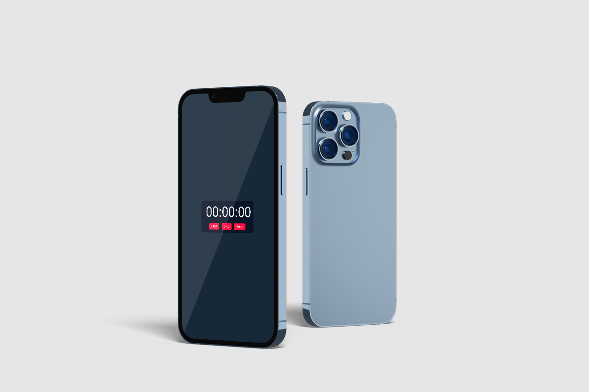

<h1>Cronômetro</h1>

  

<h2 align="center">Acesse o Cronômetro Clicando <a target="_blank" href="https://eltonalmeid.github.io/cronometro/">AQUI</a>
</h2>

## :computer: Tecnologias utilizadas

O projeto foi desenvolvido utilizando as seguintes tecnologias:

- HTML
- CSS
- JavaScript